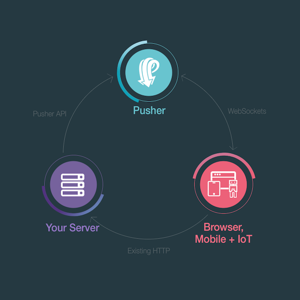

# What is Pusher? <i class="fa fa-graduation-cap fa-2"></i>

Pusher is a hosted service that makes it *super-easy* to add real-time data and functionality to web and mobile applications.

Pusher sits as a real-time layer between your servers and your clients. We maintain persistent connections to the clients - over WebSocket if possible and falling back to HTTP-based connectivity - so that as soon as your servers have new data that they want to push to the clients they can do, instantly via Pusher.

## Where next?

* [What you can build with Pusher?](./pusher-use-cases.md)
* [Get started with the workshop](../getting-started/README.md)
