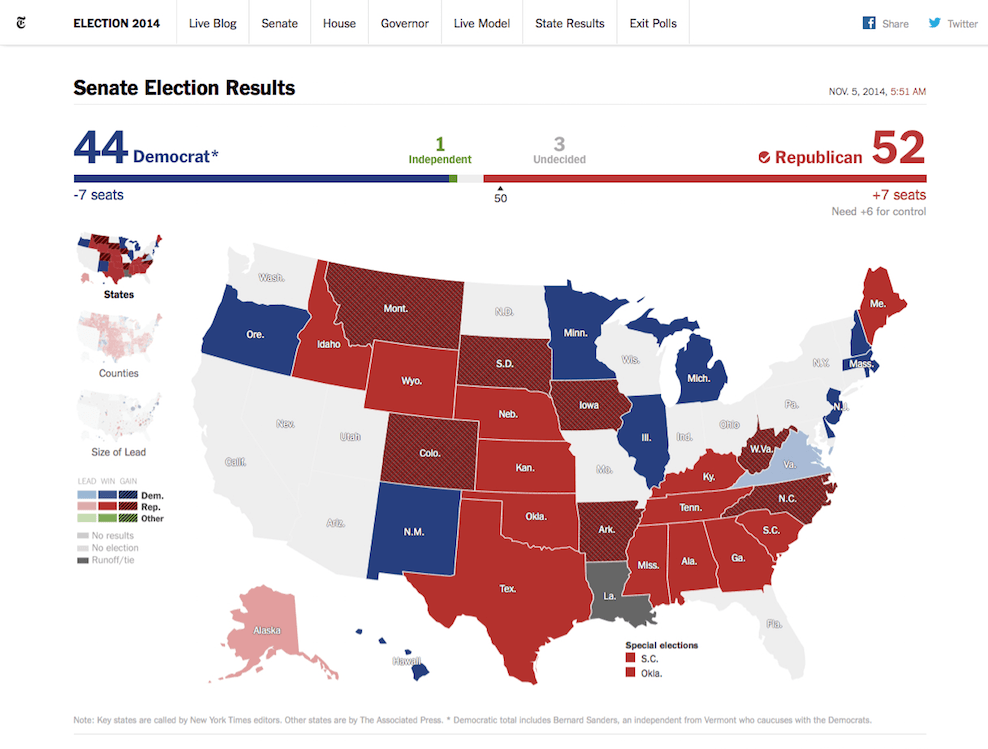

# Pusher Use Cases <i class="fa fa-graduation-cap fa-2"></i>

There are a number of common use case for real-time web technologies, and thus Pusher.

This section will cover those use cases, but don't let it confine how *you* think about using Pusher.

## Notifications & Signalling

Notifications are the simplest use case. As soon as something relevant to a user occurs let them know about it. We've seen a similar thing on Twitter for years, we get notification popups on Facebook and in many other applications.

Notifications can also be thought as a form of signalling; where there isn't a representation of the notification in the UI, but it instead triggers a reaction within an application.

## Activity Streams

Activity Streams (feeds) are at the heart of social applications. The Facebook wall, the Twitter wall is effectively an activity stream, Google+ and any other social application. News and sport apps and websites are moving towards view that represents a stream of new and important information.

The idea behind activity streams is to let you know what's been happening whilst keeping the user hooked, awaiting the next update in the timeline. And as soon as the next update is available it is streamed in.

## Data Visualisations/Dashboards

The first uses of real-time web technologies were to show real-time changes in financial data. Eventually charts and graphs followed. 

Real-time data visualisations help you spot trends in data *as it happens* and generally keep you in the know about what's happening *right now*.

## Chat

<video src="../assets/img/pie.mp4" autoplay loop width="100%">
  Your browser does not support the <code>video</code> element.
</video>

The other use case for real-time web technology that drove innovation was chat. It continues to be a core use case. In fact, in Mary Meeker's Internet Trends report for 2015, [6 of the top apps were messaging applications](http://www.slideshare.net/kleinerperkins/internet-trends-v1/47). 

Chat is continuing to grow in popularity and a real beneficial feature to any application.

## Collaborative Apps

Collaborative applications is probably one of the most progressive uses of real-time technologies right now - innovating in areas that were previously restricted to individuals working alone or where long-winded processes slowed progression. Google Docs and the multi-user collaborative experiences offered by Docs, Sheets and Slides are the go to examples.

Our own [Jamie Patel](https://twitter.com/JamiePatel) recently built [Atom Pair](https://atom.io/packages/atom-pair) which allows developers to collaborate within GitHub's Atom Editor.

## Multiplayer Games

Multiplayer games can be highly immersive and lots of fun. So it makes sense to use the Internet as the communications platform for multiplayer games. 

Whether it's trivia games like [QuizUp](https://www.quizup.com/en) or more traditional games like Asteroids, Pusher can help with the functionality and infrastructure of these apps.

## Where next?

Let's [get started with the workshop](../getting-started/README.md).
